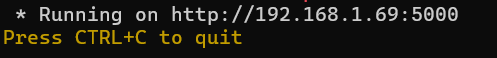

<h1 align="center">(WIP) Job hunter</h1>
<p align="center">Your aid to stay updated with the latest suitable job offers</p>
<p align="center">LLM support (Only openai compatible)</p>

## NOTE
Only jobs offered in Jeddah are supported but feel to edit /targets/(targeted site).py links list to add another page. I plan on adding support but it's a low priority.

## Another NOTE
Further updates will focus on improving the code rather than updating targeted sites. This project is still in development so the code may change a lot.

## Installation
```bash
git clone https://github.com/Momin-Ahmed-Mebarez/job_hunter.git
cd job_hunter
pip install -r requirements.txt
```

## Usage
Please check [Recommendations](#Recommendations) before running the script.
```bash
python job_hunter.py
```

## Web interface
Running the script will launch a flask self-hosted server on the provided ip. The script checks job sites every 30 minutes.
<p align="center">
  
</p>

- If conifg.json isn't set then the webpage will redirect you to /config where you can set up LLM usage.
- If you chose to use a LLM you will be directed to /cv to upload your cv.The specified llm will be used to extract rules from your cv. You can create your own cv_rules.txt in /prompts folder (This rules are the prompt used by the LLM to understand it's task).

## Recommendations
- The first time you launch the script don't use LLM validation, then visit /config and setup your LLM. In my first run I pulled 70 job offer and with more sites this number will growup.
- If you used the generated cv_rules I insist on you reviewing it manually.
- Even smaller models like lfm2.5 are able to classifiy jobs efficintly based on description (Some unsuitable offers may be mistakenlly labeld as suitable) but these models will often return uncertain when only provided the job title.
- I highly recommend not reducing any sleeps or the time between checks. 

## Disclaimer
This project is provided for educational, personal purposes only. It is a locally hosted tool that runs a Flask server on the user's own device to collect and process publicly available job listings from third-party websites.

The author does not own, control, operate, or represent any of the websites, companies, or job listings accessed through this project.

The information displayed by this project, including job titles, descriptions, company information, requirements, and links, is obtained from third-party sources. The author does not guarantee the accuracy, completeness, availability, legitimacy, quality, or reliability of any listed job opportunity. Users are responsible for independently verifying job listings and conducting their own research before applying or providing any personal information.

This project interacts with third-party websites. Users are responsible for ensuring that their use of this software complies with the applicable laws, website terms of service, robots policies, and access rules of those websites.

Using this software may result in actions taken by third-party websites, including but not limited to:

rate limiting,
temporary restrictions,
blocking of requests,
account restrictions or bans.

The author is not responsible for any consequences resulting from the use of this software with third-party websites.

This software is not intended for:

unauthorized access to systems or services,
bypassing security mechanisms,
circumventing access controls,
abusing websites or their infrastructure,
collecting or processing data in violation of applicable laws or agreements.

Users are solely responsible for how they use this software. Any misuse, abuse, or illegal activity performed using this project is the user's responsibility, not the author's.

This project is designed to run locally on the user's own device and is not intended to be exposed directly to the public internet.

Running the Flask server publicly, exposing it through port forwarding, or deploying it on an internet-accessible server may introduce security risks, including unauthorized access or misuse of the application.

Users are responsible for securing their own environment, network, and device when running this software.
